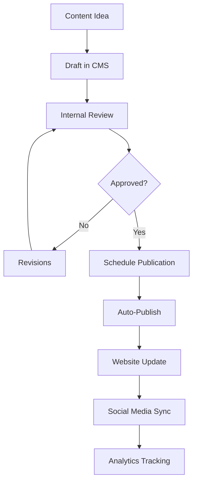
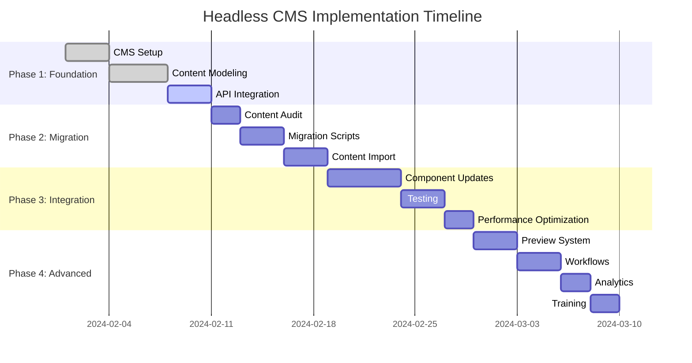

# Headless CMS Integration Strategy
## Educate an Orphan Uganda

---

## 📋 **Executive Summary**

This document outlines a comprehensive strategy for integrating a headless CMS into the Educate an Orphan Uganda website to enable easier content management, improve content workflows, and enhance the ability to update website content without requiring technical expertise.

---

## 🎯 **Objectives**

### **Primary Goals**
- **Non-Technical Content Management**: Enable staff to update content without developer assistance
- **Content Workflows**: Implement approval processes and content scheduling
- **Multi-Channel Distribution**: Reuse content across website, social media, and newsletters
- **Performance Optimization**: Maintain excellent Core Web Vitals with CMS integration
- **SEO Enhancement**: Dynamic content optimization and structured data generation

### **Success Metrics**
- **Content Update Speed**: Reduce content update time from days to minutes
- **Staff Empowerment**: Enable 3+ non-technical staff to manage content
- **Content Freshness**: Increase content update frequency by 300%
- **SEO Performance**: Maintain or improve current SEO rankings
- **Site Performance**: Keep Core Web Vitals scores above 90

---

## 🔍 **Current State Analysis**

### **Existing Content Structure**
```
Static Content (Currently Hardcoded):
├── Home Page (Hero, Mission, Impact Stats)
├── Programs Page (Program Descriptions, Success Stories)
├── Donate Page (Donation Options, Impact Information)
├── Get Involved Page (Volunteer Opportunities, Events)
├── Contact Page (Contact Information, Office Details)
├── About Page (Organization History, Team Information)
├── FAQ Page (Common Questions and Answers)
└── Blog/News Section (Future Implementation)
```

### **Current Limitations**
- **Developer Dependency**: All content changes require code deployment
- **No Version Control**: No content history or rollback capability
- **Limited Workflows**: No approval processes or content scheduling
- **SEO Challenges**: Manual structured data and meta tag management
- **Content Consistency**: Risk of inconsistent messaging across pages

---

## 🛠️ **Recommended CMS Solutions**

### **Option 1: Contentful** ⭐ **Recommended**
**Pros:**
- **Developer-Friendly**: Excellent API and SDK support
- **Performance**: Built-in CDN and image optimization
- **Scalability**: Handles high traffic volumes efficiently
- **Features**: Content modeling, workflows, localization
- **Integration**: Seamless React/Next.js integration
- **Cost**: Generous free tier for nonprofits

**Cons:**
- **Learning Curve**: More complex than simpler solutions
- **Cost**: Paid plans can be expensive for large content volumes

**Pricing:**
- **Free**: Up to 5 users, 25,000 content items, 2TB bandwidth
- **Team**: $300/month (50% nonprofit discount available)
- **Enterprise**: Custom pricing

### **Option 2: Strapi** ⭐ **Strong Alternative**
**Pros:**
- **Open Source**: Full control and customization
- **Self-Hosted**: No ongoing subscription costs
- **Flexible**: Custom plugins and extensions
- **Community**: Large developer community
- **GraphQL**: Native GraphQL support

**Cons:**
- **Maintenance**: Requires server maintenance and updates
- **Setup**: More complex initial setup
- **Performance**: Requires optimization for high traffic

**Cost:**
- **Self-Hosted**: Free (server costs only)
- **Cloud**: $99/month (50% nonprofit discount)

### **Option 3: Sanity**
**Pros:**
- **Developer Experience**: Excellent developer tools and real-time collaboration
- **Performance**: Built-in CDN and optimization
- **Flexibility**: Custom schemas and real-time updates
- **Pricing**: Generous free tier

**Cons:**
- **Complexity**: More complex than Contentful
- **Ecosystem**: Smaller ecosystem than Contentful

**Cost:**
- **Free**: Up to 3 users, 500K API requests/month
- **Team**: $199/month (nonprofit discounts available)

---

## 🏗️ **Implementation Strategy**

### **Phase 1: Foundation (Weeks 1-2)**

#### **1.1 CMS Setup**
```bash
# Contentful Setup
npm install contentful @contentful/rich-text-react-renderer

# Environment Variables
VITE_CONTENTFUL_SPACE_ID=your_space_id
VITE_CONTENTFUL_ACCESS_TOKEN=your_access_token
VITE_CONTENTFUL_PREVIEW_TOKEN=your_preview_token
```

#### **1.2 Content Modeling**
```typescript
// Content Models Structure
interface ContentModels {
  // Homepage Content
  heroSection: {
    title: string;
    subtitle: string;
    backgroundImage: Asset;
    callToAction: string;
  };
  
  // Programs
  program: {
    title: string;
    description: RichText;
    image: Asset;
    impactStats: Array<{
      label: string;
      value: string;
    }>;
  };
  
  // Blog Posts
  blogPost: {
    title: string;
    slug: string;
    author: Reference<author>;
    publishDate: Date;
    featuredImage: Asset;
    content: RichText;
    tags: Array<string>;
  };
  
  // Events
  event: {
    title: string;
    description: RichText;
    date: Date;
    location: string;
    registrationLink: string;
    image: Asset;
  };
  
  // Success Stories
  successStory: {
    title: string;
    childName: string;
    story: RichText;
    beforePhoto: Asset;
    afterPhoto: Asset;
    impactMetrics: Array<{
      metric: string;
      value: string;
    }>;
  };
}
```

#### **1.3 API Integration**
```typescript
// src/services/contentful.ts
import { createClient } from 'contentful';

export const contentfulClient = createClient({
  space: import.meta.env.VITE_CONTENTFUL_SPACE_ID,
  accessToken: import.meta.env.VITE_CONTENTFUL_ACCESS_TOKEN,
});

export const previewClient = createClient({
  space: import.meta.env.VITE_CONTENTFUL_SPACE_ID,
  accessToken: import.meta.env.VITE_CONTENTFUL_PREVIEW_TOKEN,
  host: 'preview.contentful.com',
});

// Content Fetching Hooks
export const useHomePage = () => {
  const [data, setData] = useState(null);
  const [loading, setLoading] = useState(true);
  const [error, setError] = useState(null);

  useEffect(() => {
    const fetchContent = async () => {
      try {
        const entries = await contentfulClient.getEntries({
          content_type: 'homePage',
          include: 3,
        });
        setData(entries.items[0]);
      } catch (err) {
        setError(err);
      } finally {
        setLoading(false);
      }
    };

    fetchContent();
  }, []);

  return { data, loading, error };
};
```

### **Phase 2: Content Migration (Weeks 3-4)**

#### **2.1 Content Audit**
```typescript
// Content Migration Plan
const migrationPlan = {
  homePage: {
    hero: {
      title: "Transform Lives Through Education",
      subtitle: "Join us in our mission to provide quality education to orphaned children in Uganda",
      image: "/images/hero-education.jpg",
      cta: "Donate Now"
    },
    impactStats: [
      { label: "Children Educated", value: "500+" },
      { label: "Schools Supported", value: "15" },
      { label: "Communities Reached", value: "25" }
    ]
  },
  programs: {
    // Existing program content migration
  },
  // ... other content sections
};
```

#### **2.2 Migration Scripts**
```typescript
// scripts/content-migration.ts
import { contentfulClient } from '../src/services/contentful';

export const migrateHomePage = async () => {
  const homePageContent = {
    fields: {
      title: { 'en-US': 'Educate an Orphan Uganda' },
      heroTitle: { 'en-US': 'Transform Lives Through Education' },
      heroSubtitle: { 'en-US': 'Join us in our mission...' },
      // ... other fields
    }
  };

  try {
    const entry = await contentfulClient.createEntry('homePage', homePageContent);
    await entry.publish();
    console.log('Home page migrated successfully');
  } catch (error) {
    console.error('Migration failed:', error);
  }
};
```

### **Phase 3: Component Integration (Weeks 5-6)**

#### **3.1 Dynamic Components**
```typescript
// src/components/cms/HeroSection.tsx
import { documentToReactComponents } from '@contentful/rich-text-react-renderer';
import { useHomePage } from '../../hooks/useContentful';

const HeroSection: React.FC = () => {
  const { data, loading, error } = useHomePage();

  if (loading) return <HeroSkeleton />;
  if (error) return <ErrorFallback />;

  return (
    <section className="hero-section">
      <h1>{data.fields.heroTitle}</h1>
      <p>{data.fields.heroSubtitle}</p>
      
      <Button href="/donate">{data.fields.callToAction}</Button>
    </section>
  );
};
```

#### **3.2 Rich Text Rendering**
```typescript
// src/utils/richTextOptions.ts
export const richTextOptions = {
  renderNode: {
    [BLOCKS.PARAGRAPH]: (node, children) => <p className="mb-4">{children}</p>,
    [BLOCKS.HEADING_2]: (node, children) => <h2 className="text-2xl font-bold mb-4">{children}</h2>,
    [BLOCKS.UL_LIST]: (node, children) => <ul className="list-disc list-inside mb-4">{children}</ul>,
    [BLOCKS.OL_LIST]: (node, children) => <ol className="list-decimal list-inside mb-4">{children}</ol>,
    [INLINES.HYPERLINK]: (node, children) => (
      <a href={node.data.uri} className="text-blue-600 hover:text-blue-800">
        {children}
      </a>
    ),
    [INLINES.ENTRY_HYPERLINK]: (node, children) => (
      <Link to={`/content/${node.data.target.sys.id}`} className="text-blue-600 hover:text-blue-800">
        {children}
      </Link>
    ),
  },
  renderMark: {
    [MARKS.BOLD]: text => <strong>{text}</strong>,
    [MARKS.ITALIC]: text => <em>{text}</em>,
  },
};
```

### **Phase 4: Advanced Features (Weeks 7-8)**

#### **4.1 Content Preview**
```typescript
// src/components/preview/PreviewProvider.tsx
import { previewClient } from '../../services/contentful';

const PreviewProvider: React.FC<{ children: React.ReactNode }> = ({ children }) => {
  const [isPreview, setIsPreview] = useState(false);
  const [previewToken, setPreviewToken] = useState('');

  useEffect(() => {
    const urlParams = new URLSearchParams(window.location.search);
    const preview = urlParams.get('preview');
    const token = urlParams.get('token');
    
    if (preview === 'true' && token === import.meta.env.VITE_CONTENTFUL_PREVIEW_TOKEN) {
      setIsPreview(true);
    }
  }, []);

  if (isPreview) {
    return (
      <PreviewContext.Provider value={{ client: previewClient, isPreview }}>
        <PreviewBanner />
        {children}
      </PreviewContext.Provider>
    );
  }

  return <>{children}</>;
};
```

#### **4.2 Content Scheduling**
```typescript
// src/hooks/useScheduledContent.ts
export const useScheduledContent = (contentType: string) => {
  const [data, setData] = useState(null);
  const [loading, setLoading] = useState(true);

  useEffect(() => {
    const fetchContent = async () => {
      try {
        const entries = await contentfulClient.getEntries({
          content_type: contentType,
          'fields.publishDate[lte]': new Date().toISOString(),
          order: '-fields.publishDate',
        });
        setData(entries.items);
      } catch (error) {
        console.error('Failed to fetch scheduled content:', error);
      } finally {
        setLoading(false);
      }
    };

    fetchContent();
  }, [contentType]);

  return { data, loading };
};
```

---

## 📊 **Content Management Workflow**

### **Content Creation Process**


### **User Roles and Permissions**
```typescript
// User Roles Configuration
const userRoles = {
  contentManager: {
    permissions: [
      'create:content',
      'edit:own_content',
      'delete:own_content',
      'publish:content',
    ],
    contentTypes: ['blogPost', 'event', 'successStory'],
  },
  
  contentEditor: {
    permissions: [
      'edit:assigned_content',
      'create:draft',
    ],
    contentTypes: ['blogPost', 'event'],
  },
  
  admin: {
    permissions: [
      'manage:users',
      'manage:workflows',
      'manage:settings',
      'publish:all_content',
    ],
    contentTypes: ['*'],
  },
  
  reviewer: {
    permissions: [
      'review:content',
      'approve:content',
      'reject:content',
    ],
    contentTypes: ['blogPost', 'event', 'program'],
  },
};
```

---

## 🚀 **Performance Optimization**

### **Caching Strategy**
```typescript
// src/utils/contentCache.ts
export const contentCache = {
  // Client-side caching
  clientCache: new Map(),
  
  // Cache TTL configuration
  cacheConfig: {
    homePage: 5 * 60 * 1000, // 5 minutes
    programs: 15 * 60 * 1000, // 15 minutes
    blogPosts: 10 * 60 * 1000, // 10 minutes
    events: 5 * 60 * 1000, // 5 minutes
  },
  
  // Cache middleware
  async getCachedContent(key: string, fetcher: () => Promise<any>) {
    const cached = this.clientCache.get(key);
    const ttl = this.cacheConfig[key] || 5 * 60 * 1000;
    
    if (cached && Date.now() - cached.timestamp < ttl) {
      return cached.data;
    }
    
    const data = await fetcher();
    this.clientCache.set(key, {
      data,
      timestamp: Date.now(),
    });
    
    return data;
  },
};
```

### **Image Optimization**
```typescript
// src/components/cms/OptimizedImage.tsx
const OptimizedImage: React.FC<{
  asset: Asset;
  width?: number;
  height?: number;
  quality?: number;
}> = ({ asset, width = 800, height = 600, quality = 80 }) => {
  const imageUrl = `https://images.contentful.com/${asset.sys.space}/assets/${asset.sys.id}/${asset.fields.file.url}?w=${width}&h=${height}&q=${quality}&fm=webp`;
  
  return (
    
  );
};
```

---

## 🔒 **Security Considerations**

### **API Security**
```typescript
// src/services/secureContentful.ts
export const secureContentfulClient = createClient({
  space: import.meta.env.VITE_CONTENTFUL_SPACE_ID,
  accessToken: import.meta.env.VITE_CONTENTFUL_ACCESS_TOKEN,
  // Security configurations
  host: 'cdn.contentful.com', // Use CDN for production
  environment: import.meta.env.VITE_CONTENTFUL_ENVIRONMENT || 'master',
});

// Rate limiting
export const rateLimitedFetch = async (url: string, options?: RequestInit) => {
  const response = await fetch(url, {
    ...options,
    headers: {
      'X-Contentful-User-Agent': 'EAO-Uganda-Website/1.0',
      ...options?.headers,
    },
  });
  
  if (response.status === 429) {
    const retryAfter = parseInt(response.headers.get('X-Contentful-Rate-Limit-Reset') || '60');
    await new Promise(resolve => setTimeout(resolve, retryAfter * 1000));
    return rateLimitedFetch(url, options);
  }
  
  return response;
};
```

### **Content Validation**
```typescript
// src/utils/contentValidation.ts
export const validateContent = (content: any, schema: any) => {
  const errors: string[] = [];
  
  // Required fields validation
  if (!content.fields.title) {
    errors.push('Title is required');
  }
  
  // Image validation
  if (content.fields.featuredImage) {
    const image = content.fields.featuredImage.fields;
    if (!image.file?.url) {
      errors.push('Featured image must have a valid URL');
    }
  }
  
  // Content length validation
  if (content.fields.content) {
    const contentLength = JSON.stringify(content.fields.content).length;
    if (contentLength > 50000) {
      errors.push('Content exceeds maximum length');
    }
  }
  
  return {
    isValid: errors.length === 0,
    errors,
  };
};
```

---

## 📈 **Analytics and Monitoring**

### **Content Performance Tracking**
```typescript
// src/hooks/useContentAnalytics.ts
export const useContentAnalytics = () => {
  const trackContentView = (contentType: string, contentId: string) => {
    // Google Analytics event
    gtag('event', 'page_view', {
      content_type: contentType,
      content_id: contentId,
      custom_parameter: 'content_engagement',
    });
    
    // Custom analytics
    analytics.track('Content Viewed', {
      contentType,
      contentId,
      timestamp: new Date().toISOString(),
      userAgent: navigator.userAgent,
    });
  };
  
  const trackContentInteraction = (action: string, contentType: string, contentId: string) => {
    gtag('event', 'engagement', {
      content_type: contentType,
      content_id: contentId,
      engagement_type: action,
    });
  };
  
  return { trackContentView, trackContentInteraction };
};
```

### **Content Health Monitoring**
```typescript
// src/utils/contentHealth.ts
export const contentHealthCheck = async () => {
  const checks = [
    {
      name: 'API Connectivity',
      check: async () => {
        try {
          await contentfulClient.getEntries({ limit: 1 });
          return { status: 'healthy', message: 'API responding normally' };
        } catch (error) {
          return { status: 'unhealthy', message: 'API connection failed' };
        }
      },
    },
    {
      name: 'Content Freshness',
      check: async () => {
        const entries = await contentfulClient.getEntries({
          content_type: 'blogPost',
          limit: 1,
          order: '-sys.updatedAt',
        });
        
        const lastUpdate = new Date(entries.items[0]?.sys.updatedAt);
        const daysSinceUpdate = Math.floor((Date.now() - lastUpdate.getTime()) / (1000 * 60 * 60 * 24));
        
        return {
          status: daysSinceUpdate < 30 ? 'healthy' : 'warning',
          message: `Last content update: ${daysSinceUpdate} days ago`,
        };
      },
    },
  ];
  
  const results = await Promise.all(checks.map(check => check.check()));
  return results;
};
```

---

## 💰 **Cost Analysis**

### **Contentful Cost Breakdown (Nonprofit Pricing)**
```
Team Plan: $300/month × 12 = $3,600/year
- 50% nonprofit discount: $1,800/year
- 10 users, unlimited content items
- Advanced workflows and permissions
- API rate limits: 1M requests/month
- CDN bandwidth: 2TB/month

Additional Costs:
- Image optimization: $50/month
- Backup storage: $20/month
- Developer time: 40 hours setup × $150/hour = $6,000

Total First Year: $7,870
Subsequent Years: $1,870/year
```

### **Strapi Self-Hosted Cost Breakdown**
```
Infrastructure:
- VPS: $50/month × 12 = $600/year
- Database: $30/month × 12 = $360/year
- CDN: $20/month × 12 = $240/year
- Backup storage: $20/month × 12 = $240/year

Development:
- Setup time: 60 hours × $150/hour = $9,000
- Maintenance: 4 hours/month × $150/hour × 12 = $7,200/year

Total First Year: $17,440
Subsequent Years: $8,440/year
```

---

## 📅 **Implementation Timeline**



---

## 🎯 **Success Metrics & KPIs**

### **Content Management Metrics**
- **Content Update Time**: Target < 5 minutes from draft to publish
- **Staff Adoption**: 80% of staff trained and actively using CMS
- **Content Volume**: 50% increase in content production
- **Quality Score**: 95% content passes validation checks

### **Technical Metrics**
- **Page Load Speed**: Maintain < 2 seconds average
- **Core Web Vitals**: All scores > 90
- **API Response Time**: < 500ms average
- **Cache Hit Rate**: > 85%

### **Business Metrics**
- **Donation Conversions**: Track impact of fresh content
- **Volunteer Sign-ups**: Measure engagement improvements
- **SEO Rankings**: Maintain or improve current positions
- **Social Media Engagement**: Increase shares and interactions

---

## 🔄 **Maintenance & Support**

### **Ongoing Tasks**
```typescript
// Maintenance Schedule
const maintenanceSchedule = {
  daily: [
    'Content health checks',
    'Performance monitoring',
    'Error log review',
  ],
  
  weekly: [
    'Content backup verification',
    'Security updates',
    'Performance optimization',
  ],
  
  monthly: [
    'Content audit and cleanup',
    'User training sessions',
    'Analytics review',
  ],
  
  quarterly: [
    'CMS platform updates',
    'Security audits',
    'Performance optimization',
    'Content strategy review',
  ],
};
```

### **Support Documentation**
- **User Manuals**: Step-by-step guides for each user role
- **Video Tutorials**: Screen recordings of common tasks
- **FAQ Section**: Common questions and troubleshooting
- **Contact Support**: Escalation procedures for technical issues

---

## 📋 **Decision Matrix**

| **Criteria** | **Contentful** | **Strapi** | **Sanity** | **Weight** |
|--------------|----------------|------------|------------|------------|
| **Ease of Use** | 9/10 | 7/10 | 8/10 | 20% |
| **Performance** | 9/10 | 8/10 | 9/10 | 20% |
| **Cost** | 8/10 | 9/10 | 8/10 | 15% |
| **Scalability** | 10/10 | 8/10 | 9/10 | 15% |
| **Features** | 9/10 | 8/10 | 8/10 | 10% |
| **Support** | 9/10 | 7/10 | 8/10 | 10% |
| **Integration** | 10/10 | 8/10 | 9/10 | 10% |
| **Total Score** | **9.1** | **7.9** | **8.5** | **100%** |

---

## 🎯 **Recommendation**

**Primary Recommendation: Contentful**

Based on the comprehensive analysis, **Contentful** is the recommended solution for Educate an Orphan Uganda due to:

1. **Nonprofit-Friendly**: Excellent nonprofit discount program
2. **Developer Experience**: Superior API and React integration
3. **Performance**: Built-in CDN and optimization features
4. **Scalability**: Handles growth without additional infrastructure
5. **Support**: Excellent documentation and customer support
6. **Features**: Rich feature set including workflows and localization

**Implementation Priority:**
1. **Immediate** (Next 2 months): Contentful setup and basic content migration
2. **Short-term** (3-6 months): Advanced features and workflows
3. **Long-term** (6-12 months): Full content strategy and optimization

---

## 📞 **Next Steps**

1. **Stakeholder Approval**: Review and approve this strategy
2. **Budget Allocation**: Secure funding for implementation
3. **Team Formation**: Assemble implementation team
4. **Vendor Selection**: Finalize Contentful contract
5. **Project Kickoff**: Begin Phase 1 implementation

---

*This document will be updated throughout the implementation process to reflect lessons learned and evolving requirements.*
